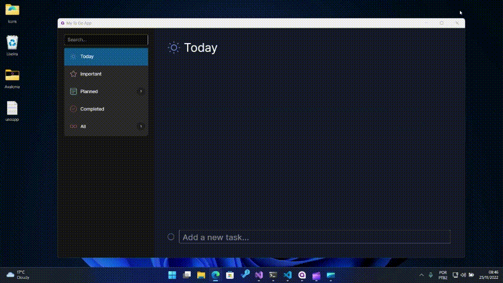
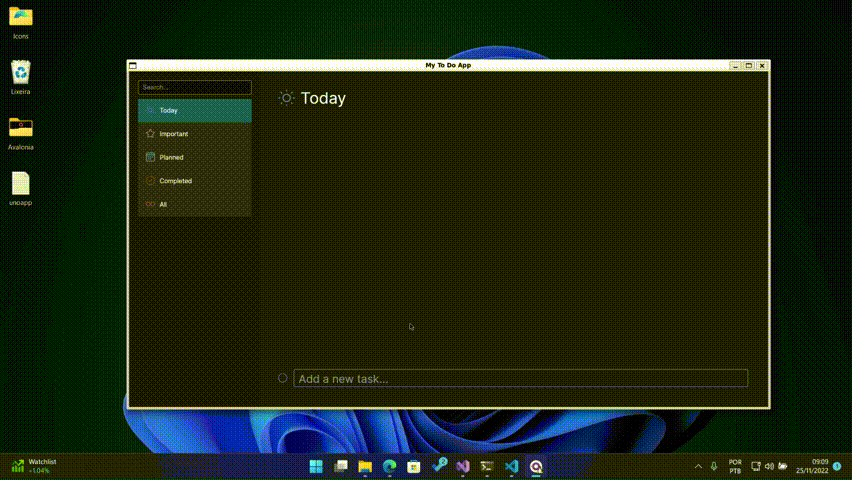

# My To Do Avalonia App

**É importante destacar que esse repositório não tem nenhuma pretenção em ser referência para nada, apenas serve como parte de aprendizado e diversão.**

Nesse repositório contém uma aplicação de controle de tarefas feita utilizando o [Avalonia UI](https://avaloniaui.net/).

Eu fiz um vídeo mostrando uma introdução ao Avalonia UI, você pode conferir [aqui](https://www.youtube.com/watch?v=s4yvwXqaSww&ab_channel=AngeloBelchior).

Eu dediquei menos de duas horas pra fazer essa aplicação, muito pelo fato do Avalonia UI ser muito simples e prático de se trabalhar. Sinceramente me surpreendeu muito esse framework e eu recomendo muito que vocês dêem uma olhada nele.

Além do Avalonia UI, é utilizado o [MVVM Community Toolkit](https://learn.microsoft.com/en-us/windows/communitytoolkit/mvvm/introduction).

Sinceramente eu não consigo imaginar uma aplicação que se propõe a utilizar os conceitos de MVVM sem utilizar essa biblioteca. Ela beira o estado da arte.

Como banco de dados é utilizado o [LiteDb](https://www.litedb.org/). Poderia ser utilizado o SQLite, mas o LiteDb foi escolhido por ser um banco de dados leve, simples de utilizar e principalmente por ser um projeto brasileiro. Conheça e apoie esse projeto!

Versão WASM (WEB): [https://angelobelchior.github.io/TodoAvaloniaApp/](https://angelobelchior.github.io/TodoAvaloniaApp/)

Versão Windows:

Versão Linux rodando via WSL:

## Bugs e melhorias

[ ] Por algum motivo na versão WASM os dados que são inseridos no LiteDb não estão sendo salvos (O banco recebe os dados, insere-os, mas ao reiniciar a aplicação o dado não está lá). Não sei se é um bug do WASM, do LiteDb no WASM ou cagada minha. **Voto na última opção**.

[ ] Não foi implementada a funcionalidade do busca (campo search).

[ ] Ao marcar uma task criada como finalizada, não existe evento para propagar a informação e por consequência atualizar os valores dos filtros.

[ ] O linker não foi configurado, está sendo utilizada a configuração default.

Minha ideia não é que essa aplicação tenha todas funcionalidades possíveis, mas sim mostrar como é simples utilizar o Avalonia UI, o MVVM Community Toolkit e o LiteDb. :)

Fique à vontade para fazer um fork e melhorar a aplicação. :)
